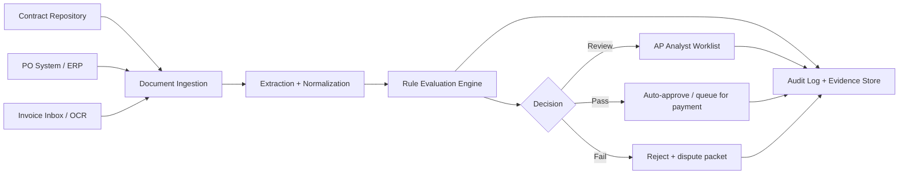
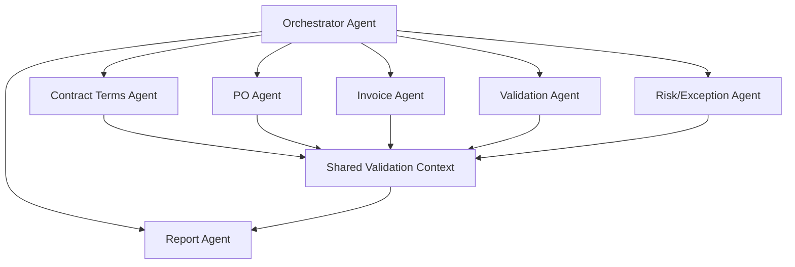
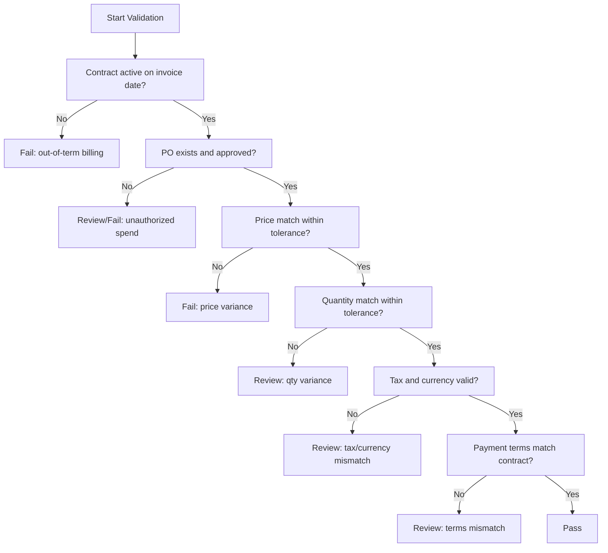
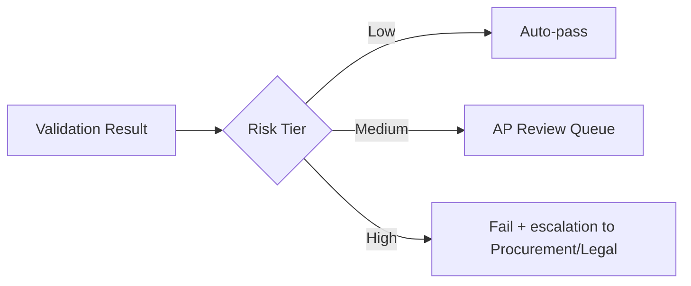

# Agno Guide: AI Agent to Validate Invoices + Purchase Orders Against Contract Terms

## Goal
Build an Agno-based agent workflow that checks vendor invoices and purchase orders (POs) against contract terms before payment approval.

## What this system should do
- Extract fields from contracts, POs, and invoices
- Normalize data into a common schema
- Validate commercial terms (price, quantity, tax, payment terms, dates, tolerances)
- Flag mismatches with severity and recommended action
- Produce an auditable decision package for AP/Finance

---

## 1) Reference architecture



---

## 2) Multi-agent design in Agno

Use specialized agents rather than one monolith.



### Suggested responsibilities
- **Contract Terms Agent**: parse governing terms (rates, unit prices, volume tiers, effective dates, penalties, payment terms, tax clauses)
- **PO Agent**: parse line items, quantities, authorized spend, approval metadata
- **Invoice Agent**: parse billed items, totals, tax, due date, bank/payment details
- **Validation Agent**: perform deterministic checks and tolerance logic
- **Risk/Exception Agent**: classify issue severity and route actions
- **Report Agent**: generate human-readable decision summary + machine JSON

---

## 3) Canonical schema (minimum viable)

Define a strict schema so every agent writes to the same structure.

```yaml
vendor_id: string
contract_id: string
po_id: string
invoice_id: string
currency: string
invoice_date: date
due_date: date
payment_terms_days: integer
line_items:
  - sku: string
    description: string
    qty_ordered: number
    qty_invoiced: number
    unit_price_contract: number
    unit_price_po: number
    unit_price_invoice: number
    tax_code: string
    line_total_invoice: number
totals:
  subtotal_invoice: number
  tax_invoice: number
  total_invoice: number
  total_po: number
controls:
  price_tolerance_pct: number
  qty_tolerance_pct: number
  amount_tolerance_abs: number
```

---

## 4) Validation logic (deterministic first)

Use rules for hard checks; use LLM judgment only where language interpretation is needed.



### Rule examples
- **Price variance**: `abs(unit_price_invoice - unit_price_contract) / unit_price_contract <= tolerance`
- **Quantity variance**: `qty_invoiced <= qty_ordered * (1 + qty_tolerance_pct)`
- **Total check**: recompute totals from lines and compare to billed total
- **Date validity**: invoice date must be within contract effective window

---

## 5) Agno implementation blueprint

> Keep this practical: orchestrator + tool-using agents + deterministic rules module.

### Components
1. **Ingestion layer**
   - Contract parser
   - PO connector (ERP/API)
   - Invoice OCR/parser
2. **Normalization layer**
   - Map extracted fields to canonical schema
3. **Validation layer**
   - Deterministic rules engine (Python module)
4. **Agno orchestration layer**
   - Agent coordination, retries, escalation, summarization
5. **Audit layer**
   - Persist source snippets, extracted values, rule outcomes, final decision

### Pseudocode flow
```python
context = orchestrator.build_context(contract_doc, po_doc, invoice_doc)
normalized = normalization_agent.run(context)
rule_results = deterministic_validator.check(normalized)
exceptions = risk_agent.classify(rule_results, normalized)
report = report_agent.generate(normalized, rule_results, exceptions)

if exceptions.blocking:
    route("FAIL", report)
elif exceptions.review_required:
    route("REVIEW", report)
else:
    route("PASS", report)
```

---

## 6) Human-in-the-loop design

Do not auto-pay everything. Add thresholds.

- **Auto-pass** only when all hard checks pass and risk score is low
- **Manual review** for ambiguous clauses, tax anomalies, or near-threshold variances
- **Auto-fail** for explicit violations (no PO, invalid contract, major price mismatch)



---

## 7) Auditability and controls

For each decision, store:
- Source document references (file + page/section)
- Extracted fields used in each check
- Rule version + threshold values
- Final status (`PASS` / `REVIEW` / `FAIL`)
- Reason codes (e.g., `PRICE_VARIANCE`, `NO_APPROVED_PO`)

This is critical for finance controls and external audit readiness.

---

## 8) Deployment checklist

- [ ] Canonical schema finalized with AP + Procurement
- [ ] Rule tolerances signed off by Finance
- [ ] Contract clause extraction tested on top 20 vendor templates
- [ ] ERP + invoice ingestion connectors stable
- [ ] Exception routing integrated (ticket/email/workflow)
- [ ] Audit log + retention policy implemented
- [ ] UAT with historical invoice set complete

---

## 9) Practical v1 scope (recommended)
Start narrow:
1. One vendor family
2. One currency
3. Standard line-item contracts only
4. Hard checks + review queue (skip auto-fail disputes initially)

Then scale to multi-vendor, tiered pricing, and complex legal clauses.

---

## 10) Suggested output format per invoice

- **Decision:** PASS / REVIEW / FAIL
- **Confidence:** 0–100
- **Top reasons:** bullet list
- **Line-level mismatches:** table/list
- **Recommended action:** approve / request credit note / escalate
- **Evidence links:** contract section, PO line, invoice line

This keeps operations fast while remaining auditable.
