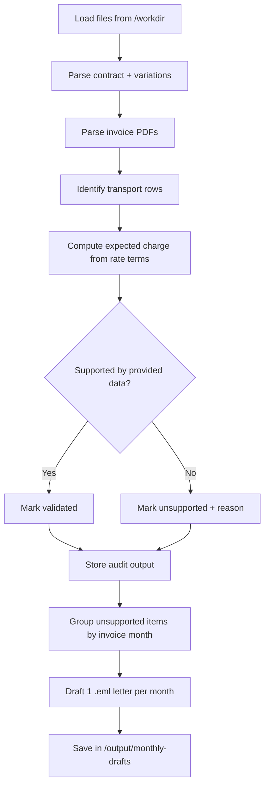
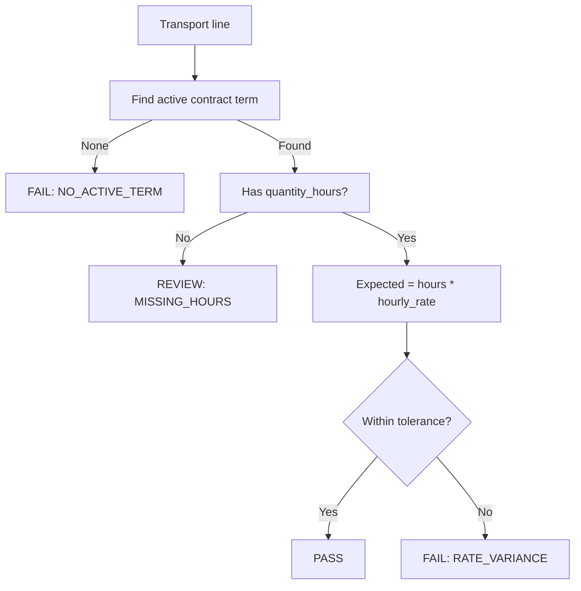

# Coates Hire Transport Validation Agent Spec (v1)

## Purpose
Build an Agno-based agent that processes Coates Hire invoice PDFs, validates transport-related charges against contract and contract variation terms, and drafts monthly evidence-request letters (as `.eml`) for unsupported transport charges.

## Scope (v1)
- Local-folder based ingestion only
- Parse PDF invoices + contract + contract variation files from agent working folder
- Detect transport rows in invoice line items
- Validate transport charges against contractual hourly rates by vehicle size/class
- Group unsupported charges by **invoice month**
- Generate **one draft letter per month** as `.eml`
- Draft-only workflow (no auto-send)

## Out of scope (future enhancement)
- Pulling documents from email inboxes automatically
- Auto-sending letters
- ERP/AP system integration

---

## Input model

### Folder layout
```text
/workdir
  /invoices
    <invoice-1>.pdf
    <invoice-2>.pdf
  /contracts
    contract.pdf
    contract-variation-1.pdf
    contract-variation-2.pdf
  /output
```

### Assumptions
- Contract and variation documents in `/contracts` are authoritative.
- Variations override base contract where effective dates and clauses apply.
- Invoices contain identifiable transport line rows (example below).

### Example transport row pattern
`19 25 1 TRANSPORT Onhire $4,237.50 $4,237.50`

---

## High-level architecture (Agno)

```mermaid
flowchart LR
    A[/invoices PDFs/] --> B[Invoice Extraction Agent]
    C[/contracts PDFs/] --> D[Contract Terms Agent]
    B --> E[Normalization Layer]
    D --> E
    E --> F[Transport Validation Engine]
    F --> G[Monthly Grouping Module]
    G --> H[Letter Draft Agent (.eml)]
    H --> I[/output/monthly-drafts/]
    F --> J[/output/audit-json/]
```

### Agent responsibilities
1. **Invoice Extraction Agent**
   - OCR/text extraction from invoice PDFs
   - Extract header fields (invoice number, date, vendor, totals)
   - Extract line items and detect `TRANSPORT` rows

2. **Contract Terms Agent**
   - Extract transport rate-card terms from contract + variations
   - Build structured rule objects: vehicle class/size, hourly rates, effective dates, conditions

3. **Validation Engine (deterministic)**
   - Map invoice transport rows to contract rule entries
   - Check billed amount against expected amount based on hours × rate (plus configured adjustments)
   - Produce pass/review/fail outcome with reason codes

4. **Letter Draft Agent**
   - Aggregate unsupported rows by invoice month
   - Draft one legal-style evidence request per month as `.eml`

---

## Process flow



---

## Canonical schema (v1)

```yaml
invoice:
  invoice_id: string
  invoice_date: date
  vendor_name: string
  source_file: string

transport_line_items:
  - line_no: string|null
    raw_text: string
    label: string                 # e.g., TRANSPORT
    subtype: string|null          # e.g., Onhire
    quantity_hours: number|null
    unit_rate_billed: number|null
    line_amount_billed: number
    currency: string

contract_terms:
  - term_id: string
    vehicle_class: string
    billing_basis: string         # hourly
    hourly_rate: number
    effective_from: date
    effective_to: date|null
    source_doc: string
    clause_ref: string|null

validation_result:
  invoice_id: string
  line_ref: string
  status: PASS|REVIEW|FAIL
  reason_codes: string[]
  expected_amount: number|null
  billed_amount: number
  variance_amount: number|null
  variance_pct: number|null
  evidence_provided: boolean
```

---

## Matching and validation rules

### Detection rule (v1)
- Mark a line as transport if normalized label contains `TRANSPORT`.
- Preserve full raw row text for audit.

### Contract matching (v1)
- Match by vehicle size/class and active effective date window from contract terms.
- If multiple candidate terms exist, choose most specific active variation term; otherwise mark `REVIEW`.

### Validation logic (v1)

### Confirmed policy settings
- Variance tolerance: **strict exact match** (0 allowed variance).
- Monetary basis: **ex-GST only** for all validation calculations.
- Response deadline: include default deadline placeholder in `.eml` drafts for later configuration.
- Vehicle normalization: derive canonical vehicle class mapping from contract + variations before rule evaluation.



### Core reason codes
- `NO_ACTIVE_TERM`
- `AMBIGUOUS_TERM_MATCH`
- `MISSING_HOURS`
- `RATE_VARIANCE`
- `MISSING_SUPPORTING_EVIDENCE`

---

## Monthly legal-style draft letters (.eml)

### Grouping
- Group by **invoice month** (`YYYY-MM`) based on invoice date.
- Produce **one draft letter per month**.

### Required inclusions
- Statement that payment of disputed transport components is on hold pending validation
- Table/list of impacted invoices and transport line amounts
- Request for supporting evidence such as:
  - third-party supplier invoices
  - PODs (Proof of Delivery)
  - related transport substantiation records
- Requested response deadline placeholder (configurable)

### Output path
```text
/output/monthly-drafts/coates-transport-evidence-request-YYYY-MM.eml
```

---

## `.eml` draft structure

- To: `<coates contact placeholder>`
- Cc: `<internal placeholders>`
- Subject: `Request for Supporting Evidence – Transport Charges – <Month YYYY>`
- Body sections:
  1. Contract reference and commercial context
  2. Summary of invoices and disputed transport charges
  3. Evidence requested
  4. Default response deadline
  5. Reservation of rights / payment hold wording (commercial-legal tone)

---

## Audit outputs

Write machine-readable evidence packs:

```text
/output/audit-json/
  validation-results.json
  unmatched-transport-lines.json
  term-extraction-log.json
```

Each finding must carry:
- source file name
- extracted raw text snippet
- mapping decision
- rule result and reason codes

---

## Operational constraints
- Draft-only: no outbound sending.
- No destructive edits to source files.
- Deterministic validation first; LLM interpretation only for extraction/mapping ambiguity handling.

---

## Open items to confirm before implementation
1. Tolerance policy for variance checks:
   - **Confirmed:** strict match only (no variance tolerance).
2. GST/tax handling:
   - **Confirmed:** all comparisons performed **ex-GST**.
3. Legal letter defaults:
   - **Partially confirmed:** include a default response deadline field in each draft `.eml` (exact duration to be configured).
4. Vehicle class taxonomy:
   - **Confirmed approach:** normalize vehicle classes from contract + variation documents into a canonical mapping table before validation.

