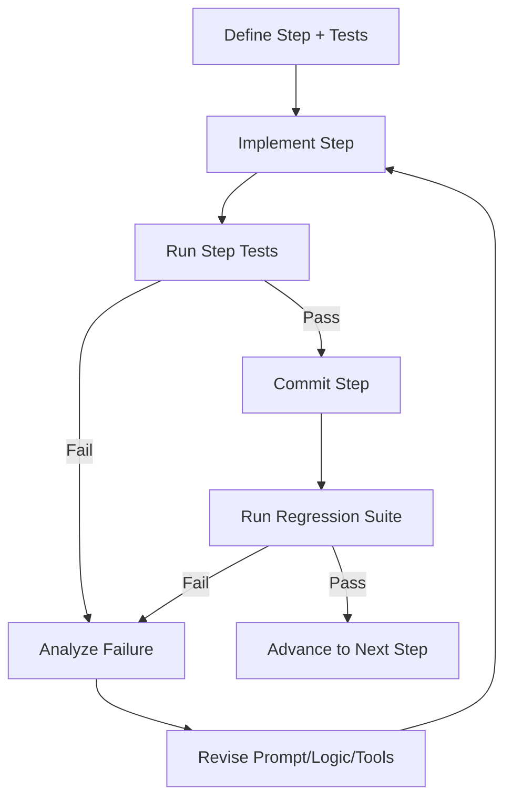

# Agent Development Process - TDD Loop (Invoice Validation)

## Why this note exists
I want a repeatable development process for building reliable agent workflows.  
The core idea: **define process → define tests per step → build framework → solve one step at a time using a test loop (TDD-style).**

---

## Core Process (meta)

1. **Define the target process**
   - Write the end-to-end workflow in plain language.
   - Name each step with clear input/output.

2. **Write tests before implementation**
   - For each step, define pass/fail criteria.
   - Include happy path + edge cases + adversarial cases.

3. **Build the technical framework**
   - Data model
   - Tool interfaces
   - Orchestration logic
   - Observability + logs
   - Recovery/fallback behavior

4. **Decompose into atomic steps**
   - Split each step until it can be solved in a single focused prompt or coding task.

5. **Implement one step at a time**
   - Prompt agent to solve only Step N.
   - Run tests for Step N.
   - Refine until green.

6. **Run self-development loop**
   - Use failed tests to generate improvements.
   - Re-run tests after each change.
   - Promote patterns that consistently pass.

7. **Integrate + regression test**
   - Re-run all step tests + end-to-end scenario tests.

8. **Document lessons**
   - Capture what failed, what fixed it, what to reuse.

---

## TDD-style Agent Self-Development Loop



### Loop Rules
- Never change multiple variables at once unless necessary.
- Prefer smallest fix that makes tests pass.
- Keep a changelog of failure modes.
- If stuck after N iterations (e.g. 3), escalate with explicit hypothesis list.

---

## Use Case: Invoice Validation

## Goal
Given an invoice document + purchase/order context, determine whether invoice is valid and payable, with explicit reasons.

## High-level pipeline
1. Ingest invoice input
2. Extract structured fields
3. Validate vendor + metadata
4. Validate line items + arithmetic
5. Match against PO/contract/receipt
6. Policy/compliance checks
7. Risk scoring + exception handling
8. Final decision + audit output

---

## Step-by-step with tests

### Step 1 — Ingest Invoice Input
**Input:** PDF/image/email payload  
**Output:** normalized artifact + metadata (source, received_at, checksum)

**Tests**
- Accepts PDF/JPG/PNG
- Rejects empty/corrupt files
- Produces deterministic checksum
- Captures source channel metadata

### Step 2 — Extract Structured Fields
**Input:** normalized artifact  
**Output:** JSON fields (invoice_no, vendor, date, due_date, currency, totals, tax, line_items)

**Tests**
- Mandatory fields present or explicitly null with reason
- Confidence scores per field
- Correct extraction on known fixtures
- Handles multi-page invoice

### Step 3 — Validate Vendor + Metadata
**Input:** extracted JSON + vendor master data  
**Output:** vendor validation status + issues

**Tests**
- Vendor exists and is active
- ABN/VAT/tax id format valid (if required)
- Duplicate invoice number check
- Bank detail mismatch detection

### Step 4 — Validate Math + Line Items
**Input:** extracted JSON  
**Output:** arithmetic validation report

**Tests**
- subtotal + tax == total (within tolerance)
- line quantity × unit price == line amount
- rounding policy respected
- negative line handling rules

### Step 5 — Match Against PO / GRN / Contract
**Input:** extracted JSON + procurement records  
**Output:** match status (2-way/3-way) + mismatches

**Tests**
- PO exists and is open
- Item-level match within tolerance
- quantity does not exceed received
- detects missing PO when policy requires it

### Step 6 — Policy & Compliance Checks
**Input:** prior validations + policy rules  
**Output:** policy decision + violations

**Tests**
- approval threshold routing is correct
- blocked vendor check
- tax/compliance required fields present
- weekend/holiday processing exception rule works

### Step 7 — Risk Scoring + Exception Strategy
**Input:** full validation context  
**Output:** risk score + action (auto-approve/review/reject)

**Tests**
- score reproducibility
- high-risk triggers human review
- explainability: each score component documented
- edge-case override paths logged

### Step 8 — Final Decision + Audit Trail
**Input:** all prior outputs  
**Output:** decision package + audit record

**Tests**
- decision includes reasons + evidence links
- machine-readable + human-readable outputs
- immutable audit log entry created
- idempotent re-run behavior

---

## Technical Framework Blueprint

## 1) Data Contracts
- `InvoiceRaw`
- `InvoiceExtracted`
- `ValidationResult`
- `DecisionPackage`
- `AuditRecord`

## 2) Rule Engine
- Rule IDs, severity, rationale, remediation hint
- Versioned rule sets for governance

## 3) Test Harness
- Fixture library (good invoices, bad invoices, tricky edge cases)
- Deterministic expected outputs
- Regression suite and scorecard

## 4) Orchestration
- Directed step graph with retry policies
- Clear step boundaries and handoff schema validation

## 5) Observability
- Structured logs with correlation IDs
- Step timing, failure reasons, and test trends

## 6) Human-in-the-loop layer
- Escalation queue for exceptions
- reviewer feedback captured and fed back into tests

---

## Prompt Pattern (solve one step at a time)
Use this template for focused agent execution:

```text
You are implementing Step {N}: {Step Name}.
Goal: {single-step outcome}.
Inputs: {schemas + sample payload}.
Constraints: Do not modify other steps.
Definition of Done:
- {test_1}
- {test_2}
- {test_3}
Return:
1) Implementation summary
2) Test results (pass/fail)
3) Known limitations
4) Next minimal improvement
```

---

## Practical rollout plan

### Phase A — Foundation
- Define schemas + fixture set
- Build test harness skeleton
- Implement Step 1 + Step 2

### Phase B — Validation Core
- Implement Step 3, 4, 5
- Run mismatch-heavy edge case suite

### Phase C — Decisioning
- Implement Step 6, 7, 8
- Add audit and explainability outputs

### Phase D — Reliability hardening
- Regression automation
- Drift monitoring
- Monthly rule review cadence

---

## Quality checklist (before production)
- [ ] Every step has explicit tests
- [ ] Every failed test maps to a fix strategy
- [ ] End-to-end run has explainable decision output
- [ ] Human-review path exists and is measurable
- [ ] Regression suite green on latest changes

---

## Questions to finalize this note (for Matt)
1. Which invoice system is source-of-truth (Xero, MYOB, SAP, NetSuite, other)?
2. Do you need **2-way** or **3-way** matching by default?
3. What tolerance thresholds should apply (price %, qty %, total rounding)?
4. What are the auto-approve limits (amount + risk score)?
5. Which compliance checks are mandatory (ABN/GST, PO required, approval matrix)?
6. What output format do you want for daily ops (Slack/Telegram summary, CSV, dashboard)?
7. Should failed cases auto-create a review task (and where)?
8. Do you want this framework generalized beyond invoices (e.g., contracts, expenses, payroll)?

