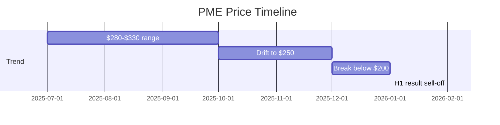

# Pro Medicus (ASX: PME) — Stock Analysis

**Date:** 2026-02-16
**Sector:** Healthcare — Health Information Services
**Website:** [promed.com.au](https://www.promed.com.au)

---

## Company Overview

Pro Medicus is an Australian medical imaging software company. Their flagship product **Visage 7** is a cloud-based radiology viewing and workflow platform sold to major US hospital systems on a **per-scan transactional model** — essentially recurring revenue with volume upside as client exam numbers grow.

---

## Current Snapshot

| Metric | Value |
|---|---|
| **Last Price** | ~$118.30 AUD |
| **52-Week High** | $336.00 |
| **52-Week Low** | $113.67 |
| **Market Cap** | ~$12.2B AUD |
| **Trailing P/E** | 52.0x |
| **Forward P/E** | 61.4x |
| **Price/Book** | 31.4x |
| **Beta** | 0.60 |
| **Dividend Yield** | 0.54% |

---

## Price Action — 12 Month Summary

The stock has fallen **~59% from its 52-week high** of $336 (mid-July 2025) to ~$118. The decline accelerated sharply in the last 6 weeks.

- **Jul–Oct 2025:** Ranged $280–$330, then started drifting lower
- **Nov–Dec 2025:** Broke below $250, accelerated to $217
- **Jan 2026:** Crashed through $200 support, hit $171
- **Feb 2026:** H1 result triggered another 15–16% drop, now near 52-week lows

---

## H1 FY2026 Results (12 Feb 2026)

Strong operationally, but the stock got hammered due to sky-high expectations.

| Metric | H1 FY26 | YoY Change | vs Consensus |
|---|---|---|---|
| **Revenue** | $128.9M | +28% | ❌ Miss ($131.8M) |
| **Underlying EBIT** | $90M | +29% | — |
| **EBIT Margin** | 72% | — | — |
| **Underlying Profit** | $90.7M | +29.7% | — |
| **Statutory NPAT** | $171.2M | >3x | Inflated by 4DMedical |
| **Interim Dividend** | 32c | +28% | ❌ Miss (35c) |

### Key Details
- **7 new contract wins** worth >$280M
- **5-year forward contracted revenue** exceeded **$1.08 billion** for the first time
- Statutory profit inflated by **$149.1M unrealised gain** on 4DMedical investment ($10M hybrid debt/equity investment) — strip this out for core analysis

### Why It Sold Off
At ~110x forward P/E before the result, "good" wasn't enough. Revenue missed by ~$3M, and the market repriced aggressively. The 4DMedical gain inflated headlines but the underlying growth, while excellent, didn't accelerate enough to justify the premium.

---

## Growth Profile

| Metric | Value |
|---|---|
| **Implied Revenue CAGR** | ~28% |
| **Implied EPS CAGR** | ~24% |
| **Growth Regime** | High-growth |
| **FY26E Revenue** | $275M |
| **FY27E Revenue** | $353M |
| **FY26E EPS** | $1.53 |
| **FY27E EPS** | $1.91 |

> ⚠️ FY27 EPS estimates have been **revised down** from $2.04 → $1.91 over the last 90 days.

---

## Balance Sheet — Pristine

| Metric | Jun 2025 | Jun 2024 |
|---|---|---|
| **Cash & Equivalents** | $175M | $124M |
| **Total Debt** | $2.3M | $2.1M |
| **Working Capital** | $237M | $173M |
| **Retained Earnings** | $239M | $173M |
| **Total Assets** | $339M | $258M |

Essentially **zero real debt** (only lease obligations). Rock solid.

---

## Bull Case 🟢

- Best-in-class medical imaging platform with **72% EBIT margins**
- Transactional per-scan model = recurring revenue with volume upside
- **$1B+ contracted forward revenue** gives outstanding visibility
- Zero debt, $175M cash
- Massive US healthcare TAM still largely unpenetrated
- 7 new contract wins worth $280M in H1 alone
- After a **59% drawdown**, valuation has compressed significantly (52x trailing vs 110x+ at peak)

## Bear Case 🔴

- Even at $118, still trading at **52–61x earnings** — still premium
- Revenue *missed* consensus in H1 — growth may not be accelerating fast enough
- FY27 EPS estimates being **revised downward**
- 4DMedical gain masks the underlying earnings picture
- Customer concentration risk (large US hospital systems)
- AUD/USD exposure on US-denominated contracts

---

## Verdict

PME is a genuinely elite business — the margins, recurring model, and contract pipeline are outstanding. The question is purely about **valuation**.

It's fallen 59% from highs, making it significantly cheaper, but at 52–61x earnings it's still pricing in years of strong execution. The downward EPS revisions and revenue miss suggest it's not a slam dunk "buy the dip" — would want to see the next quarter confirm the growth trajectory before getting aggressive.

**Watch for:** Next quarterly update / contract announcements to confirm whether the growth trajectory is intact.

---

*Analysis generated 2026-02-16. Data sourced from Yahoo Finance & public reporting. Not investment advice.*
