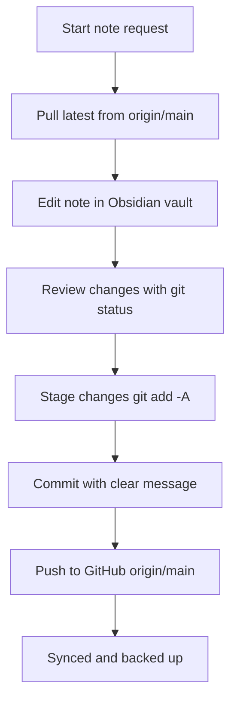

# Obsidian Git Sync Process

```mermaid
flowchart TD
    A[Start note request] --> B[Pull latest from origin/main]
    B --> C[Edit note in Obsidian vault]
    C --> D[Review changes with git status]
    D --> E[Stage changes git add -A]
    E --> F[Commit with clear message]
    F --> G[Push to GitHub origin/main]
    G --> H[Synced and backed up]
```
